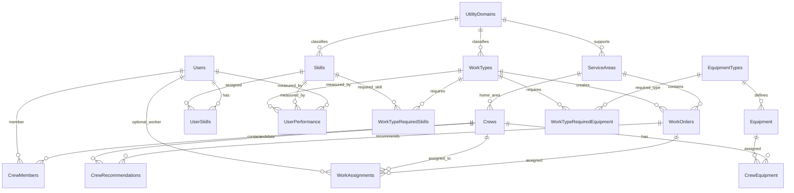

# Workforce Labor Intelligence Demo
## SQL Data Dictionary and Table Diagram

**Purpose:** Demo-sized workforce dispatch data model for Gas + Electric utility work.  
**Goal:** Show understanding of workforce assignment concepts without building a full enterprise WFM system.

The demo supports:

- Gas, Electric, and Shared utility work
- Service areas displayed on an ESRI JavaScript API / React map
- Workers, crews, skills, rates, equipment, work orders, assignments, and recommendations
- Performance-adjusted cost comparison instead of simple lowest hourly rate
- Routing and live crew movement simulated outside the database

---

## 1. Demo Scope

This is intentionally not a full workforce management platform. The model is designed to prove the concept:

> Recommend the best qualified crew at the lowest effective cost, not just the cheapest hourly rate.

The demo focuses on:

- Who is qualified?
- Who has the right skills?
- Who has the right equipment?
- Who belongs to the correct service area?
- What is the labor rate?
- How fast does that worker or crew typically complete the work?
- What is the performance-adjusted total cost?

The demo intentionally leaves out:

- Live GPS tracking
- Turn-by-turn routing
- Route history
- Inventory management
- Mobile photo capture
- Full union rules
- Full certification tracking
- AVL / vehicle telemetry

Routing and moving crew points should be handled by a separate **Routing Simulation Service** after assignment.

---

## 2. High-Level Architecture

```text
Local SQL Database
        ↓
Local REST API
        ↓
React Web App
        ↓
ESRI JavaScript API Map
        ↓
Route Simulation Service
```

The SQL database owns the persistent demo data.

The routing simulation service owns temporary/living map behavior such as:

- Current crew point
- Animated route path
- ETA countdown
- En Route / On Site / Complete status movement

---

## 3. Table Diagram



---

## 4. Core Lookup Tables

## UtilityDomains

Defines whether a record belongs to Gas, Electric, or Shared utility operations.

| Field | Type | Key | Notes |
|---|---|---|---|
| UtilityDomainID | int | PK | 1 = Gas, 2 = Electric, 3 = Shared |
| DomainName | varchar(50) |  | Gas, Electric, Shared |
| DisplayColor | varchar(20) |  | Used by map/demo styling |
| IsActive | bit |  | Active flag |

---

## ServiceAreas

Used to draw service territory polygons on the ESRI map.

| Field | Type | Key | Notes |
|---|---|---|---|
| ServiceAreaID | int | PK | Unique service area |
| ServiceAreaName | varchar(100) |  | Example: North Electric District |
| UtilityDomainID | int | FK | Gas, Electric, or Shared |
| ServiceAreaType | varchar(50) |  | District, Region, Zone |
| GeoJsonPolygon | nvarchar(max) |  | Polygon geometry for the map |
| FillColor | varchar(20) |  | Map fill color |
| OutlineColor | varchar(20) |  | Map outline color |
| DisplayOrder | int |  | Layer/display order |
| IsActive | bit |  | Active flag |

---

# 5. Workforce Tables

## Users

Represents workers, inspectors, QA staff, safety personnel, contractors, and supervisors.

| Field | Type | Key | Notes |
|---|---|---|---|
| UserID | int | PK | Worker identifier |
| FirstName | varchar(50) |  | First name |
| LastName | varchar(50) |  | Last name |
| WorkerType | varchar(50) |  | Employee, Contractor, Vendor |
| DefaultCraft | varchar(100) |  | Lineman, Inspector, Gas Tech, QA |
| HomeServiceAreaID | int | FK | Base service area |
| AvailabilityStatus | varchar(50) |  | Available, Assigned, Off |
| PerformanceScore | decimal(5,2) |  | Overall demo performance score |
| SafetyScore | decimal(5,2) |  | Safety score |
| QualityScore | decimal(5,2) |  | QA / rework score |
| IsActive | bit |  | Active flag |

---

## Skills

Skills may be Gas, Electric, or Shared.

| Field | Type | Key | Notes |
|---|---|---|---|
| SkillID | int | PK | Skill identifier |
| SkillName | varchar(100) |  | Example: Gas Leak Investigation |
| UtilityDomainID | int | FK | Gas, Electric, or Shared |
| SkillCategory | varchar(50) |  | Inspection, Repair, Safety, QA |
| RequiresCertification | bit |  | Whether certification is required |
| IsCriticalSkill | bit |  | Emergency/compliance skill |
| IsActive | bit |  | Active flag |

### Suggested Shared Skills

These can apply to both Gas and Electric utility work:

| Shared Skill | Why It Matters |
|---|---|
| Utility Inspector | Field inspection across assets and work types |
| Safety Observer | Required for higher-risk work |
| QA/QC Inspector | Validates completed field work |
| Traffic Control | Supports roadway and right-of-way work |
| Excavation / Trenching | Used for gas mains and underground electric |
| Locate / Markout | Needed before digging |
| Damage Assessment | Storm, outage, leak, and emergency response |
| Drone Inspection | Pole, ROW, substation, and corridor inspection |
| GIS Field Data Collection | As-builts, asset verification, map corrections |
| Survey / GPS Collection | Supports both gas and electric records |
| Environmental Compliance | ROW, wetlands, spill, and construction support |
| Crew Supervisor / Foreman | Field leadership role |
| Scheduler / Dispatcher | Shared operations function |
| Emergency Response Coordinator | Coordinates restoration or response activities |

---

## UserSkills

Many-to-many relationship between workers and skills.

| Field | Type | Key | Notes |
|---|---|---|---|
| UserSkillID | int | PK | Unique user skill record |
| UserID | int | FK | Worker |
| SkillID | int | FK | Skill |
| SkillLevel | varchar(50) |  | Apprentice, Journeyman, Senior, Expert |
| ProficiencyScore | decimal(5,2) |  | 1-100 score |
| CertifiedFlag | bit |  | Whether worker is certified for this skill |
| LastUsedDate | date |  | Optional freshness indicator |

---

## UserPerformance

Tracks performance by user, skill, and work type.

This is important because a worker may be fast at inspections but slower at emergency repairs.

| Field | Type | Key | Notes |
|---|---|---|---|
| UserPerformanceID | int | PK | Unique performance record |
| UserID | int | FK | Worker |
| SkillID | int | FK | Skill |
| WorkTypeID | int | FK | Work type |
| AvgEstimatedHours | decimal(8,2) |  | Historical estimated hours |
| AvgActualHours | decimal(8,2) |  | Historical actual hours |
| ProductivityFactor | decimal(8,4) |  | Estimated hours / actual hours |
| FirstTimeFixRate | decimal(5,2) |  | Percent completed without revisit |
| ReworkRate | decimal(5,2) |  | Percent requiring correction |
| JobsCompleted | int |  | Sample size |

### Performance Concept

```text
Effective Labor Cost = Hourly Rate × Estimated Job Hours ÷ ProductivityFactor
```

Example:

| Worker | Hourly Rate | Avg Hours | Effective Cost |
|---|---:|---:|---:|
| Person A | $65/hr | 8 hrs | $520 |
| Person B | $95/hr | 4 hrs | $380 |

Person B wins even though their hourly rate is higher.

---

# 6. Rate Tables

## RateCards

Defines rate schedules for internal labor, vendors, or contractors.

| Field | Type | Key | Notes |
|---|---|---|---|
| RateCardID | int | PK | Rate card identifier |
| RateCardName | varchar(100) |  | Example: Internal 2026 |
| VendorName | varchar(100) |  | Optional vendor/contractor name |
| EffectiveStartDate | date |  | Rate start date |
| EffectiveEndDate | date |  | Rate end date |
| IsActive | bit |  | Active flag |

---

## SkillRates

Stores labor rates by skill and skill level.

| Field | Type | Key | Notes |
|---|---|---|---|
| SkillRateID | int | PK | Unique skill rate |
| RateCardID | int | FK | Rate card |
| SkillID | int | FK | Skill |
| SkillLevel | varchar(50) |  | Apprentice, Journeyman, Senior, Expert |
| StandardHourlyRate | decimal(10,2) |  | Base hourly rate |
| OvertimeRate | decimal(10,2) |  | Overtime rate |
| CalloutRate | decimal(10,2) |  | Emergency/callout rate |

---

# 7. Work Tables

## WorkTypes

Defines the kind of work to be performed.

| Field | Type | Key | Notes |
|---|---|---|---|
| WorkTypeID | int | PK | Work type identifier |
| WorkTypeName | varchar(100) |  | Transformer Outage, Gas Leak Investigation |
| UtilityDomainID | int | FK | Gas, Electric, or Shared |
| DefaultEstimatedHours | decimal(8,2) |  | Default demo estimate |
| RequiresCrew | bit |  | Whether a crew is required |
| DefaultPriority | varchar(50) |  | Normal, High, Emergency |
| IsActive | bit |  | Active flag |

---

## WorkTypeRequiredSkills

Defines which skills are needed for each work type.

| Field | Type | Key | Notes |
|---|---|---|---|
| WorkTypeSkillID | int | PK | Unique requirement |
| WorkTypeID | int | FK | Work type |
| SkillID | int | FK | Required skill |
| MinimumSkillLevel | varchar(50) |  | Required level |
| RequiredQuantity | int |  | Number of people needed |
| MandatoryFlag | bit |  | Required vs preferred |

---

## WorkOrders

Represents demo work displayed on the ESRI map.

| Field | Type | Key | Notes |
|---|---|---|---|
| WorkOrderID | int | PK | Work order identifier |
| WorkOrderNumber | varchar(50) |  | Example: WO-1001 |
| WorkTypeID | int | FK | Type of work |
| UtilityDomainID | int | FK | Gas or Electric |
| ServiceAreaID | int | FK | Map/service area |
| Latitude | decimal(10,7) |  | Work order point |
| Longitude | decimal(10,7) |  | Work order point |
| Priority | varchar(50) |  | Emergency, High, Normal |
| Status | varchar(50) |  | New, Assigned, Complete |
| EstimatedHours | decimal(8,2) |  | Estimated duration |
| DueDate | datetime |  | SLA/demo due date |
| MapSymbol | varchar(50) |  | Icon type for map |

---

# 8. Equipment Tables

## EquipmentTypes

Defines categories of equipment/tools needed to complete work.

| Field | Type | Key | Notes |
|---|---|---|---|
| EquipmentTypeID | int | PK | Equipment type identifier |
| EquipmentTypeName | varchar(100) |  | Bucket Truck, Gas Detector, Locator |
| UtilityDomainID | int | FK | Gas, Electric, or Shared |
| Category | varchar(50) |  | Vehicle, Tool, Safety, Test Equipment |
| RequiresCertification | bit |  | Whether a worker must be certified |
| IsActive | bit |  | Active flag |

---

## Equipment

Represents actual equipment assets available to crews.

| Field | Type | Key | Notes |
|---|---|---|---|
| EquipmentID | int | PK | Equipment asset identifier |
| EquipmentTypeID | int | FK | Equipment type |
| EquipmentName | varchar(100) |  | Example: Bucket Truck 12 |
| Status | varchar(50) |  | Available, Assigned, Maintenance |
| HomeServiceAreaID | int | FK | Base service area |
| HourlyCost | decimal(10,2) |  | Demo equipment cost |
| IsActive | bit |  | Active flag |

---

## WorkTypeRequiredEquipment

Defines required equipment/tools for each work type.

| Field | Type | Key | Notes |
|---|---|---|---|
| WorkTypeEquipmentID | int | PK | Unique equipment requirement |
| WorkTypeID | int | FK | Work type |
| EquipmentTypeID | int | FK | Required equipment type |
| RequiredQuantity | int |  | Number needed |
| MandatoryFlag | bit |  | Required vs preferred |

### Example Required Equipment

| Work Type | Equipment |
|---|---|
| Gas Leak Investigation | Combustible gas indicator, gas pressure gauge, PPE, locator, service vehicle |
| Electric Pole Replacement | Bucket truck, digger derrick, hot sticks, voltage tester, arc flash PPE |
| Field Inspection | Tablet, GPS receiver, camera, PPE, vehicle |
| Damage Assessment | Tablet, camera/drone, PPE, vehicle |

---

# 9. Crew Tables

## Crews

Represents a field crew.

| Field | Type | Key | Notes |
|---|---|---|---|
| CrewID | int | PK | Crew identifier |
| CrewName | varchar(100) |  | Example: Electric Crew A |
| CrewType | varchar(50) |  | Gas, Electric, Shared |
| HomeServiceAreaID | int | FK | Base area |
| SupervisorUserID | int | FK | Foreman/supervisor |
| AvailabilityStatus | varchar(50) |  | Available, Assigned, Off |
| IsActive | bit |  | Active flag |

---

## CrewMembers

Associates workers to crews.

| Field | Type | Key | Notes |
|---|---|---|---|
| CrewMemberID | int | PK | Unique crew member record |
| CrewID | int | FK | Crew |
| UserID | int | FK | Worker |
| RoleOnCrew | varchar(50) |  | Foreman, Lineman, Inspector, QA |
| IsActive | bit |  | Active flag |

---

## CrewEquipment

Associates equipment to crews.

| Field | Type | Key | Notes |
|---|---|---|---|
| CrewEquipmentID | int | PK | Unique crew equipment record |
| CrewID | int | FK | Crew |
| EquipmentID | int | FK | Equipment |
| IsActive | bit |  | Active flag |

---

# 10. Assignment and Recommendation Tables

## WorkAssignments

Stores selected/assigned crew for a work order.

| Field | Type | Key | Notes |
|---|---|---|---|
| AssignmentID | int | PK | Assignment identifier |
| WorkOrderID | int | FK | Work order |
| CrewID | int | FK | Assigned crew |
| UserID | int | FK nullable | Optional individual worker assignment |
| AssignmentStatus | varchar(50) |  | Recommended, Assigned, Complete |
| EstimatedLaborCost | decimal(12,2) |  | Demo labor estimate |
| EstimatedEquipmentCost | decimal(12,2) |  | Demo equipment estimate |
| PerformanceAdjustedCost | decimal(12,2) |  | Key demo metric |
| AssignedDate | datetime |  | Date/time assigned |
| CompletedDate | datetime |  | Optional completion date |

---

## CrewRecommendations

Stores ranked candidate crews for a work order.

| Field | Type | Key | Notes |
|---|---|---|---|
| RecommendationID | int | PK | Recommendation identifier |
| WorkOrderID | int | FK | Work order |
| CrewID | int | FK | Candidate crew |
| QualifiedFlag | bit |  | Whether crew is qualified |
| SkillMatchScore | decimal(5,2) |  | 0-100 skill match |
| EquipmentMatchScore | decimal(5,2) |  | 0-100 equipment match |
| PerformanceScore | decimal(5,2) |  | 0-100 performance score |
| EstimatedLaborCost | decimal(12,2) |  | Base labor cost |
| EstimatedEquipmentCost | decimal(12,2) |  | Equipment cost |
| PerformanceAdjustedCost | decimal(12,2) |  | Final recommendation cost |
| RecommendationRank | int |  | 1, 2, 3 |
| ExplanationText | varchar(500) |  | Human-readable reason |

---

# 11. Recommendation Logic

## Qualification Check

```text
Crew Qualified =
Required Skills
+ Required Skill Levels
+ Required Equipment
+ Availability
+ Service Area Fit
```

## Cost Logic

```text
Performance Adjusted Cost =
Labor Cost
+ Equipment Cost
- Productivity Benefit
+ Risk Penalty
```

## Demo-Friendly Explanation

Example:

```text
Crew B is recommended because they have the required gas leak investigation skill,
the correct gas detector equipment, and a stronger productivity score. Although
the hourly rate is higher than Crew A, the expected completion time is lower,
resulting in the lowest performance-adjusted cost.
```

---

# 12. REST Service Endpoints for ESRI React Map

## Map Data

```http
GET /api/map/service-areas
GET /api/map/work-orders
GET /api/map/crews
GET /api/map/dashboard
```

## Workforce Data

```http
GET /api/work-orders/{workOrderId}/recommendations
POST /api/work-orders/{workOrderId}/assign
GET /api/crews/{crewId}
GET /api/crews/{crewId}/skills
GET /api/crews/{crewId}/equipment
```

## Simulation Triggers

```http
POST /api/simulation/routes/start
GET /api/simulation/routes/{assignmentId}/status
```

The simulation endpoints do not need to persist live GPS in SQL for the first demo.

---

# 13. Map Display Fields

## Service Area Map Fields

```text
ServiceAreaID
ServiceAreaName
UtilityDomainID
GeoJsonPolygon
FillColor
OutlineColor
DisplayOrder
```

## Work Order Map Fields

```text
WorkOrderID
WorkOrderNumber
WorkTypeID
UtilityDomainID
ServiceAreaID
Latitude
Longitude
Priority
Status
EstimatedHours
DueDate
MapSymbol
```

## Crew Map Fields

For the demo, crew location can be generated by the route simulation service.

Persistent crew fields still needed:

```text
CrewID
CrewName
CrewType
HomeServiceAreaID
SupervisorUserID
AvailabilityStatus
```

---

# 14. Final Demo Story

1. Dispatcher opens the ESRI React map.
2. Gas, Electric, and Shared service areas display as polygons.
3. Work orders display as map points.
4. Dispatcher clicks a work order.
5. System displays recommended crews.
6. Recommendation explains skill match, equipment match, rate, and productivity.
7. Dispatcher assigns the work order.
8. Route Simulation Service creates a moving crew point and route line.
9. Crew status changes from Assigned to En Route to On Site to Complete.

The core story:

> This system does not simply pick the cheapest hourly rate. It picks the best qualified crew based on skills, equipment, service area, and performance-adjusted cost.
